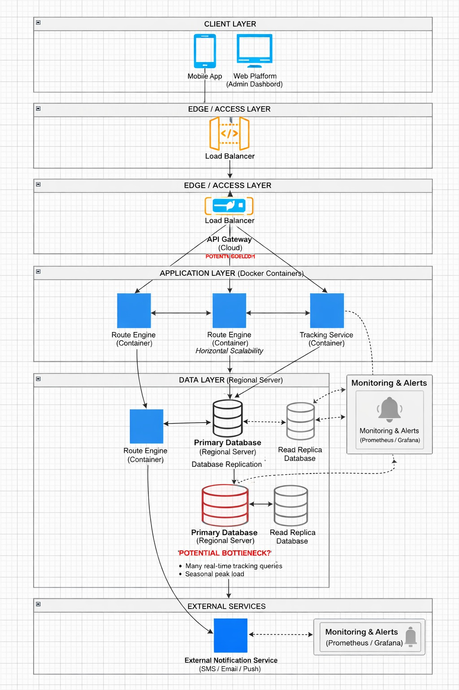

# Taller 4: Mapa de Infraestructura y Diagnóstico Técnico

## 1. Objetivo

El objetivo de este taller es construir un mapa lógico de la infraestructura tecnológica del sistema del caso base RedExpress y realizar un diagnóstico técnico identificando debilidades, cuellos de botella y oportunidades de mejora dentro de la arquitectura del sistema.

## 2. Descripción del caso base: RedExpress

RedExpress es una plataforma de logística que permite gestionar envíos y realizar seguimiento de paquetes en tiempo real a través de una aplicación móvil utilizada por mensajeros y una plataforma web utilizada por clientes y administradores.

La infraestructura del sistema combina servicios desplegados en la nube con servidores regionales encargados de procesar información relacionada con rutas, estados de paquetes y consultas de rastreo. Debido a la naturaleza del negocio, el sistema debe garantizar alta disponibilidad, capacidad de respuesta en tiempo real y escalabilidad ante aumentos de demanda, especialmente durante temporadas de alto volumen como campañas promocionales o fechas comerciales.

El modelado de la infraestructura permite visualizar cómo interactúan los distintos componentes tecnológicos del sistema, así como identificar posibles riesgos relacionados con disponibilidad, latencia, capacidad de procesamiento o dependencia de componentes críticos.

## 3. Descripción del mapa de infraestructura propuesto

El mapa de infraestructura se organiza en varias capas que representan los diferentes niveles de la arquitectura del sistema.

A continuación se presenta el mapa de infraestructura propuesto para la plataforma RedExpress. El diagrama muestra las diferentes capas del sistema, incluyendo clientes, acceso, servicios de aplicación, capa de datos, monitoreo e integración con servicios externos.

### 3.1 Client Layer

En la capa de cliente se encuentran las interfaces utilizadas por los usuarios finales del sistema:

- **Mobile App** utilizada por los mensajeros para registrar entregas, consultar rutas y actualizar el estado de los paquetes.
- **Web Platform (Admin Dashboard)** utilizada por administradores y operadores para gestionar envíos, monitorear operaciones y consultar información del sistema.

Estas aplicaciones envían solicitudes a la infraestructura a través de internet.

### 3.2 Edge / Access Layer

En esta capa se ubican los componentes encargados de gestionar el acceso al sistema.

- **Load Balancer:** distribuye el tráfico entrante entre los diferentes servicios disponibles para evitar sobrecarga en un solo nodo.
- **API Gateway (Cloud):** actúa como punto central de entrada para todas las solicitudes provenientes de las aplicaciones cliente. Este componente gestiona autenticación, enrutamiento de solicitudes y control de acceso hacia los servicios internos.

El API Gateway representa un punto crítico dentro de la arquitectura, ya que centraliza la comunicación entre clientes y servicios.

### 3.3 Application Layer

La capa de aplicación está compuesta por servicios desplegados en contenedores, lo que permite escalar horizontalmente los componentes del sistema según la demanda.

Entre los servicios principales se encuentran:

- **Route Engine:** servicio encargado de calcular y optimizar rutas de entrega para los mensajeros.
- **Tracking Service:** servicio responsable de procesar y almacenar los eventos de rastreo de los paquetes.

La arquitectura permite desplegar múltiples instancias de estos servicios para mejorar la escalabilidad y distribuir la carga de procesamiento.

### 3.4 Data Layer

La capa de datos está compuesta por servidores regionales que almacenan la información principal del sistema.

Los componentes principales son:

- **Primary Database:** base de datos principal donde se registran los estados de los paquetes, rutas y eventos de rastreo.
- **Read Replica Database:** réplicas de lectura que permiten distribuir las consultas sin afectar el rendimiento de la base de datos principal.

El sistema utiliza replicación de bases de datos para mejorar la disponibilidad y permitir consultas simultáneas desde múltiples servicios.

### 3.5 Monitoring and Alerts

El sistema incluye herramientas de monitoreo como **Prometheus y Grafana**, las cuales permiten:

- Supervisar el estado de los servicios.
- Detectar fallos en la infraestructura.
- Generar alertas ante problemas de rendimiento o disponibilidad.

Este componente es fundamental para garantizar la observabilidad del sistema y reaccionar rápidamente ante incidentes.

### 3.6 External Services

La arquitectura también integra servicios externos utilizados para la comunicación con los usuarios:

- **External Notification Service:** encargado de enviar notificaciones por SMS, correo electrónico o notificaciones push a los clientes y mensajeros.

Este servicio se utiliza para informar eventos como confirmación de envío, cambios de estado o entregas completadas.

## 4. Diagnóstico de cuellos de botella y riesgos

A partir del análisis del mapa de infraestructura se identificaron varios riesgos potenciales dentro del sistema.

### 4.1 Punto único de falla en el API Gateway

El API Gateway funciona como el único punto de entrada hacia los servicios internos. Si este componente presenta fallas o se satura, todas las solicitudes del sistema podrían verse afectadas.

**Impacto:**
- Interrupción del acceso a la plataforma.
- Degradación del servicio para aplicaciones móviles y web.

**Posible solución:**
Implementar múltiples instancias del API Gateway con balanceo de carga y mecanismos de alta disponibilidad.

### 4.2 Alta carga sobre la base de datos principal

El sistema depende de una base de datos principal que recibe constantemente consultas relacionadas con el rastreo de paquetes.

Durante temporadas de alto tráfico, como campañas comerciales o fechas especiales, el volumen de consultas puede aumentar considerablemente.

**Impacto:**
- Lentitud en consultas de rastreo.
- Saturación del servidor de base de datos.

**Posible solución:**
Incrementar el uso de réplicas de lectura y utilizar mecanismos de caché para consultas frecuentes.

### 4.3 Latencia en rastreo en tiempo real

Los mensajeros actualizan constantemente el estado de los paquetes mediante la aplicación móvil. Si los servidores están concentrados en una sola región, puede generarse latencia para usuarios ubicados en zonas geográficas lejanas.

**Impacto:**
- Retrasos en la actualización del estado de los envíos.
- Experiencia de usuario degradada.

**Posible solución:**
Desplegar servidores regionales adicionales o utilizar infraestructura distribuida en la nube.

### 4.4 Procesamiento intensivo del motor de rutas

El servicio de cálculo de rutas puede requerir gran capacidad de procesamiento cuando existen muchos envíos simultáneos.

**Impacto:**
- Retrasos en la asignación de rutas.
- Ineficiencias en la logística de entregas.

**Posible solución:**
Escalar horizontalmente el servicio de cálculo de rutas mediante contenedores adicionales.

## 5. Conclusiones

El análisis del mapa de infraestructura de RedExpress permite identificar varios puntos críticos relacionados con la disponibilidad, el rendimiento y la escalabilidad del sistema.

Aunque la arquitectura contempla mecanismos como contenedores, replicación de bases de datos y monitoreo de servicios, existen riesgos potenciales asociados con puntos únicos de falla y altas cargas de consultas en tiempo real.

La implementación de estrategias como balanceo de carga adicional, infraestructura distribuida, uso de caché y escalabilidad horizontal puede contribuir a mejorar la resiliencia y el rendimiento general de la plataforma.

El modelado de la infraestructura constituye un paso fundamental para comprender el funcionamiento técnico del sistema y para identificar oportunidades de mejora en arquitecturas orientadas a servicios y plataformas distribuidas.